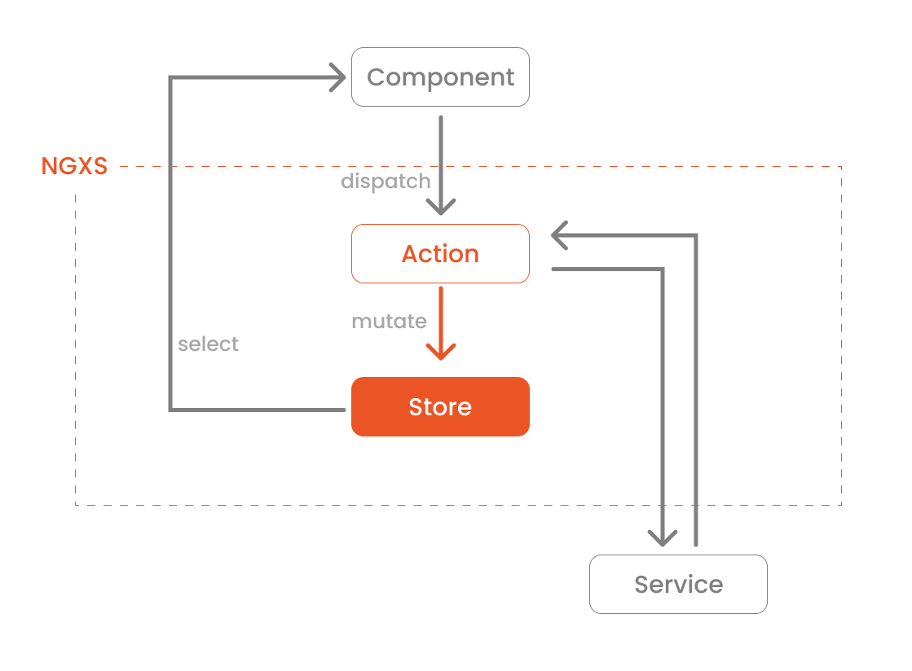

# Angular NGXS

- **NGXS** is a state management pattern and library for Angular. NGXS acts as a single source of truth for your application's state - providing simple rules for predictable state mutations.


- **NGXS** is modeled after the CQRS pattern - a pattern implemented in state management libraries such as NgRx and Redux. NGXS combines this pattern with TypeScript's classes and decorators to create a state management library with minimal boilerplate.

## Installation

```
npm install @ngxs/store --save
```

### Devtools (optional)

```
npm install @ngxs/devtools-plugin --save-dev
```

## Structure

NGXS is made up of 4 main components:

* Store;
* Actions;
* State;
* Select.

## Workflow / Architecture



## References

1. [State Management in Angular Using NGXS](https://auth0.com/blog/state-management-in-angular-with-ngxs-part-1/).
